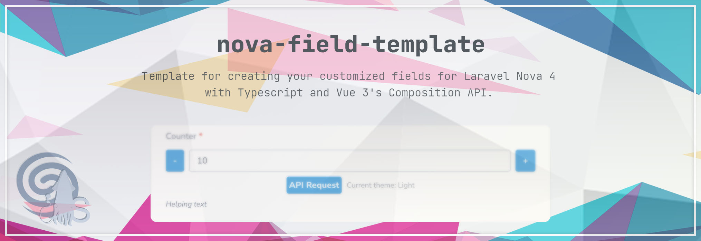

# Nova Field Template


> An opinionated template for creating your customized fields for Laravel Nova 4 with Typescript and Vue 3's Composition API.

This template aims to speed up the development of Laravel Nova fields by setting up all the relevant stuff that is common on all our packages. This is an opinionated template: we implemented what we usually need in our projects. Feel free to change it to your needs.

Those are the main selling points:

- **Nova 4**: this template relies entirely on Nova 4 (no compatibility with Nova 3)
- **Vue 3 Composition API**: thanks to our [squidlab-it/nova-vue3-helper](https://github.com/squidlab-it/nova-vue3-helper) package, the Vue part of the field is entirely made in Vue 3's Composition API.
- **Typescript**: the Vue part is entirely written in Typescript
- **Eslint and Prettier**: this project has ESLint and Prettier pre-configured to ensure linting and uniform JS styling 
- **Pint**: this project has Laravel Pint pre-configured to ensure uniform PHP styling
- **Tailwind**: Tailwind is configured to work with an additional root CSS class so that your styling won't collide with other components and with Nova's css. You're free to use any tailwind classes, since those will be packed in your field's css file.
- **Javascript Aliases**: Three aliases `@`, `@css` and `@root` to keep your imports more stable
- **ViteJS**: ViteJS is already preconfigured to build your field
- **I18n**: Thanks to [outl1ne/nova-translations-loader](https://github.com/outl1ne/nova-translations-loader) you can easily define your own translations files
- **Easy custom config and routes**: By an already pre-developed service provider, you can easily add a configuration file and routes to your field 
- **Semantic Versioning**: This project is supposed to use semantic versioning to keep your GitHub commits' history standardized. This is also needed for semantic-release (see next point).
- **Continuous Integration**: Thanks to pre-configured GitHub workflows, every relevant commit in your `main` branch will trigger a release in the `release` branch with automatically generated changelogs and versioning tags.

Take note that this template aims to work always with the latest version of PHP, Laravel and Laravel Nova. So, if you need compatibility with a specific older version, you might need to change something or use an older version. 

# Development

First, clone this repository to start working on your field.

As this is only a template, you have to rename the default component name and namespace with your own. In particular, you should change the following stuff:

- rename config
- Change the package name in the `package.json` file
- Change the package name, the namespace and the autoload FQCNs in the `composer.json` file
- Change the namespace of all PHP files under `./src`
- Rename the field file `./src/NovaFieldTemplate.php` and its class name with the name of your field 
- Change the const `FIELD_NAME` in `./src/Providers/FieldServiceProvider` with your field name in kebab-case (this should match your `package.json` package name, without the author/organization part (e.g, from `@squidlab/nova-field-template` to `nova-field-template`). 

When done, execute following commands:

> composer install

> yarn install
 
> yarn nova:install

Now you should be able to work on your field and customize it to your needs.

This template relies heavily on [squidlab-it/nova-vue3-helper](https://github.com/squidlab-it/nova-vue3-helper) for the Vue part, so you should look at that project for additional information. 

To build the component, you can choose between two commands:

- `yarn watch`: Starts a watcher which re-builds the component at every file change (useful during development)
- `yarn build`: To make a production build

## Setup Git

Since you've cloned this repo, you should remove `.git` folder and then re-initialize git to point to your own repository.

By default, this template requires the creation of two branches, `main` and `release`: `main` branch should represent your production-ready branch, and `release` represent the releases and is handled entirely by continuous integration workflows triggered by commits on the `main` branch (you should never commit directly on `release`).

So, after configuring your repository (`git init` and `git remote add origin ...`), you should at first create the `main` branch, create your first commit and push it to git. 

Then, starting from that commit, create a new branch `release`. 

When you check out `release`, you should notice how the `.gitignore` is automatically changed to include also the `./dist` folder. This is intentional: the `dist` folder with the build assets is **not** ignored only on the `release` branch.

Before committing the `.gitignore` to the `release` branch, execute a `yarn build` to produce your production assets. Now, commit the assets (in `./dist` folder) and the `.gitignore` in the `release` branch.

This is the only and last time you'll touch the `release` branch: from now on, every subsequent commit on `main` will trigger a workflow which will merge the changes on the `release` branch together with the newly compiled production assets.

## Define your routes
You can define routes under the `./routes` folder as you're used in your Laravel installation. But there is a specific nomenclature in the filename:

- `nova-field-api`: routes will be prefixed by `/<your-package>-api`, and uses `nova:api` middleware group (the user must be authenticated and authorized to interact with Nova) 
- `field-api`: routes will be prefixed by `/<your-package>-api`, and uses `api` middleware group (which usually is for public APIs)


- `nova-web-public`: routes will be prefixed by your nova path, usually `/nova`, and uses `nova` middleware group (the same used for public Nova pages)
- `nova-web`: routes will be prefixed by your nova path, usually `/nova`, and uses `nova:api` middleware group (the user must be authenticated and authorized to interact with Nova)


- `api`: routes will be prefixed by `/api`, and uses `api` middleware group
- `web`: uses `web` middleware group

Any other filename will still be registered, using the file name as middleware group (e.g. `custom.php` will have `custom` as middleware group) and no prefix.

You'll have to handle eventual route collisions with other routes (such as from Nova or other packages).

Following the provided approach, you can easily add your own routing logic by changing the `routeConfiguration()` method in `./src/Traits/LoadRoutes.php`. 

## Define your configs
Every config placed under the `./config` will be registered and considered as publishable.

## Define your translations
Every translation file under `./resource/lang` will be registered both on Laravel and Vue side and considered as publishable.

# Using your field

To use your field on a Laravel Nova project, you have three choices:

### Via symlink

Add the following section in your `repositories` array in your `composer.json`:
```json5
{
  // ...
  "repositories": [
    {
      "type": "path",
      "url": "../<path-to-your-package>",
      "options": {
        "symlink": true
      }
    },
    // ...
  ],
  // ...
}
```
And then run a `composer require <your-package>:@dev`. 

If your running Laravel Sail, you probably have to add a volume mapping between your package directory and some path inside the laravel container, for example:
```yaml
version: '3'
services:
    laravel.test:
        image: sail-8.2/app
        # ...
        volumes:
            - '.:/var/www/html'
            - '../your-local-package:/var/www/your-local-package' # <-- add something like this
    # ...
```

### Via VCS (git)
Add the following section in your `repositories` array in your `composer.json`:
```json5
{
  // ...
  "repositories": [
    {
      "type": "vcs",
      "url": "https://github.com/<your-user>/<your-repo>"
    },
    // ...
  ],
  // ...
}
```

And then run a `composer require <your-package>`. 

The available versions are represented by git tags (e.g., if you have a `v1.0.0` tag you can specify `^1.0.0` as the required version) but you can also choose to point to a specific branch by prefixing its name with `dev-` (e.g., `dev-main` to refer to the `main` branch).

### Via packagist

Just release a new version of your package in [packagist.org](https://packagist.org/) or other package repositories and then run a `composer require <your-package>`. 

If you're using other package repositories rather than packagist, you might have to configure the repository accordingly.  

# GitHub Actions

There are some GitHub workflows in this template that you might use as well. But if you don't need them, you're free to remove them.

## Eslint
Runs eslint on the Vue part and automatically makes a commit to fix styling when needed

This is triggered by every commit, in any branch except for `release`.

## Pint
Runs Laravel Pint on the PHP part and automatically makes a commit to fix styling when needed

This is triggered by every commit, in any branch except for `release`.

## Build
Executes Larastan for static code analysis and Laravel Pest for testing. When both are successful, the vue part is built and a commit in branch `release` is made with the last changes and with the Vue's production build.  

## Release
By using semantic-release, for every commit in the `release` branch a new release is made (a new git tag is added and a GitHub release is made with the changelog). 
